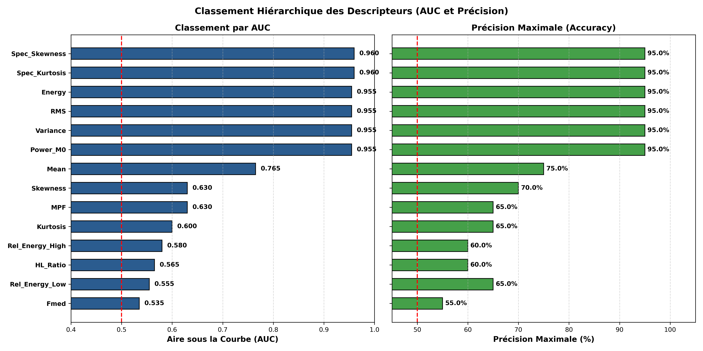

# Feature Extraction, Evaluation, and Ranking on Surface EMG Signals  

## 1. Introduction and Biomechanical Context

Surface electromyography (**sEMG**) is a primary non-invasive biomedical engineering modality utilized to record and characterize the electrical manifestations of neuromuscular activations. The sEMG interference pattern originates from the algebraic spatio-temporal superposition of Motor Unit Action Potential trains (**MUAPTs**) generated by muscle fibers and transmitted across subcutaneous adipose and dermal tissue layers to surface detection electrodes.

In biomedical machine learning pipelines, pattern recognition, and computer-aided diagnostics, **feature extraction** constitutes the cornerstone step. Raw sEMG recordings represent high-dimensional, stochastic, and inherently non-stationary signals corrupted by baseline drift and ambient interference. Feature extraction maps this complex observation space ($\mathbb{R}^N$ where $N = 50\,000$ temporal samples) into a compact, low-dimensional feature space ($\mathbb{R}^p$) that preserves task-relevant discriminative information while discarding redundant variance.

The fundamental goals of this practical session are to:
1. Program a fully modular **MATLAB** library implementing all signal processing features covered in the lecture: temporal, statistical, and spectral metrics.
2. Quantify the **discriminative power** of each individual feature to separate two distinct muscular contraction intensities using boxplot dispersion analysis and Receiver Operating Characteristic (**ROC**) curves.
3. Compute the Area Under the Curve (**AUC**) and maximum classification accuracy (**Accuracy**) to establish a rigorous **hierarchical feature ranking**.
4. Provide an in-depth biomechanical and physiological critique explaining the performance disparity observed across feature categories.

---

## 2. Presentation of the sEMG Database

The dataset provided for this study was generated using a validated, realistic biomechanical sEMG model that simulates motor unit anatomy, innervation geometry, action potential propagation, and neural drive modulation.

### Acquisition Parameters:
- **Total number of records:** 20 distinct MAT files (`EMG1.mat` to `EMG20.mat`).
- **Recording duration:** $T = 5\text{ s}$.
- **Sampling frequency:** $F_e = 10\,000\text{ Hz} = 10\text{ kHz}$.
- **Sample count per recording:** $N = F_e \times T = 50\,000\text{ samples}$.
- **Sampling period:** $T_e = \frac{1}{F_e} = 0.1\text{ ms}$.

### Class Distribution:
- **Class 1 (`EMG1` to `EMG10`):** Low / moderate muscle contraction intensity.
- **Class 2 (`EMG11` to `EMG20`):** High muscle contraction intensity.

This task is formulated as a balanced binary classification problem ($K = 2$) with 10 observations per class.

---

## 4. Methodology for Discriminative Power Evaluation

### 4.1 Dispersion Analysis via Boxplots
The initial exploratory stage assesses feature separability through boxplot visualization. Each boxplot illustrates:
- Median (solid centerline).
- 25th ($Q_1$) and 75th ($Q_3$) percentiles defining the Interquartile Range ($\text{IQR} = Q_3 - Q_1$).
- Whiskers demarcating non-outlier limits ($[Q_1 - 1.5\,\text{IQR}, \, Q_3 + 1.5\,\text{IQR}]$).
- Individual outliers.

A feature exhibits **strong discriminative capability** when the interquartile boxes of both classes are completely disjoint with minimal intra-class variance compared to inter-class margin.

---

### 4.2 Single-Threshold Linear Classifier
For any 1D feature $\phi \in \mathbb{R}$, a linear decision boundary is parameterized by a scalar threshold $\theta$.
First, the decision direction is determined:
$$\text{Direction} = \begin{cases} 
\text{Direct} & \text{if } \bar{\phi}_{\text{Class 2}} \ge \bar{\phi}_{\text{Class 1}} \\
\text{Inverse} & \text{if } \bar{\phi}_{\text{Class 2}} < \bar{\phi}_{\text{Class 1}}
\end{cases}$$

For a given threshold $\theta$, the binary predicted label $\hat{y}_i(\theta) \in \{0, 1\}$ (with $0 = \text{Class 1}$, $1 = \text{Class 2}$) is assigned via:
$$\hat{y}_i(\theta) = \begin{cases}
1 & \text{if } \phi_i \ge \theta \quad (\text{Direct}) \\
0 & \text{if } \phi_i < \theta
\end{cases}$$

---

### 4.3 Confusion Matrix and Performance Metrics
Comparing predictions $\hat{y}_i(\theta)$ against ground truth labels $y_i$ yields the $2 \times 2$ confusion matrix:
- **True Positives ($TP$):** Class 2 samples correctly classified as Class 2.
- **False Positives ($FP$):** Class 1 samples erroneously classified as Class 2.
- **True Negatives ($TN$):** Class 1 samples correctly classified as Class 1.
- **False Negatives ($FN$):** Class 2 samples missed and assigned to Class 1.

Key performance indices follow standard definitions (lecture slides 730–742):
1. **Sensitivity (True Positive Rate, $\text{TPR}$):**
   $$\text{Sensitivity} = \frac{TP}{TP + FN} \times 100\%$$
2. **Specificity (True Negative Rate, $\text{TNR}$):**
   $$\text{Specificity} = \frac{TN}{TN + FP} \times 100\%$$
3. **False Positive Rate ($\text{FPR}$):**
   $$\text{FPR} = 1 - \text{Specificity} = \frac{FP}{TN + FP} \times 100\%$$
4. **Overall Accuracy ($Acc$):**
   $$Acc(\theta) = \frac{TP + TN}{TP + TN + FP + FN} = \frac{t}{n} \times 100\%$$
   Maximum accuracy is identified at the optimal threshold $\theta^* = \arg\max_{\theta} Acc(\theta)$.

---

### 4.4 ROC Curves and Area Under the Curve (AUC) Calculation
The **Receiver Operating Characteristic (ROC)** curve plots Sensitivity ($\text{TPR}$) against $1 - \text{Specificity}$ ($\text{FPR}$) across all possible threshold values $\theta \in [-\infty, +\infty]$.

- An ideal classifier reaches $(0, 1)$ ($\text{FPR} = 0$, $\text{TPR} = 1$), representing 100% sensitivity and 100% specificity.
- The random guess baseline is defined by the line $y = x$ ($\text{AUC} = 0.5$).

**AUC Evaluation:**
The Area Under the Curve is integrated using the composite trapezoidal rule over sorted, monotonic $(\text{FPR}_k, \text{TPR}_k)$ pairs:
$$\text{AUC} = \int_0^1 \text{TPR}(\text{FPR}) \, d(\text{FPR}) \approx \sum_{k=1}^{M-1} \frac{\text{TPR}_k + \text{TPR}_{k+1}}{2} \cdot (\text{FPR}_{k+1} - \text{FPR}_k)$$

## 6. Analysis:
- The curves for **Spectral Skewness**, **Spectral Kurtosis**, **RMS**, **Energy**, and **Variance** surge sharply toward the upper-left coordinate $(0, 1)$, achieving $\text{TPR} = 1.0$ (100% sensitivity) at an $\text{FPR} \le 0.1$ (90% specificity). Their AUC values reside in the elite tier ($0.955 - 0.960$).
- The **Mean** curve shows moderate performance ($\text{AUC} = 0.765$).
- The curves for **MPF**, **Temporal Kurtosis**, **Fmed**, and the **$H/L$ Ratio** hover close to the 45-degree diagonal ($\text{AUC} \in [0.53, 0.63]$), confirming their inadequacy for contraction level discrimination.

---

## 7. Hierarchical Feature Ranking

### 6.1 Feature Ranking Summary (Figure 6)

*Figure 6: Hierarchical feature ranking by Area Under the Curve (AUC, left) and Maximum Classification Accuracy (right).*

The evaluated features naturally partition into **three distinct performance tiers**:
1. **Tier 1: Elite Discriminators ($\text{AUC} \ge 0.95$, $\text{Accuracy} = 95.0\%$):**
   - *Spectral Skewness* ($\text{AUC} = 0.960$)
   - *Spectral Kurtosis* ($\text{AUC} = 0.960$)
   - *Root Mean Square (RMS)* ($\text{AUC} = 0.955$)
   - *Total Energy* ($\text{AUC} = 0.955$)
   - *Sample Variance* ($\text{AUC} = 0.955$)
   - *Total Spectral Power $M_0$* ($\text{AUC} = 0.955$)
2. **Tier 2: Intermediate Features ($0.70 \le \text{AUC} < 0.80$, $70\% \le \text{Accuracy} \le 75\%$):**
   - *Arithmetic Mean* ($\text{AUC} = 0.765$, $\text{Acc} = 75.0\%$)
   - *Temporal Skewness* ($\text{AUC} = 0.630$, $\text{Acc} = 70.0\%$)
3. **Tier 3: Ineffective Features ($\text{AUC} < 0.65$, $\text{Accuracy} \le 65\%$):**
   - *Mean Power Frequency (MPF)* ($\text{AUC} = 0.630$, $\text{Acc} = 65.0\%$)
   - *Temporal Kurtosis* ($\text{AUC} = 0.600$, $\text{Acc} = 65.0\%$)
   - *Relative High-Frequency Energy* ($\text{AUC} = 0.580$, $\text{Acc} = 60.0\%$)
   - *High-to-Low ($H/L$) Ratio* ($\text{AUC} = 0.565$, $\text{Acc} = 60.0\%$)
   - *Relative Low-Frequency Energy* ($\text{AUC} = 0.555$, $\text{Acc} = 65.0\%$)
   - *Median Frequency (Fmed)* ($\text{AUC} = 0.535$, $\text{Acc} = 55.0\%$)

---

### 6.2 Biomechanical and Physiological Interpretation

#### Why do energy and amplitude metrics (RMS, Variance, Energy, $M_0$) perform with high accuracy?
During voluntary skeletal muscle contractions, the Central Nervous System modulates mechanical output through two physiological mechanisms:
1. **Spatial recruitment of motor units:** According to Henneman's size principle, small, slow-twitch motor units (Type I fibers) are recruited first, followed by larger, high-threshold motor units (Type II fast-twitch fibers) as demand rises. Fast-twitch units possess larger axon diameters and higher muscle fiber counts, producing MUAPs of substantially larger electrical amplitude.
2. **Rate coding (firing frequency modulation):** Active motoneurons elevate their discharge frequencies at higher contraction levels, compounding constructive spatio-temporal interference at the electrode site.

Both mechanisms synergistically elevate the overall signal amplitude envelope. Consequently, RMS (which climbs from $1.10\text{ mV}$ to $1.55\text{ mV}$) and total energy provide near-optimal discrimination between contraction levels.

#### Why do MPF and Median Frequency fail to discriminate contraction levels?
This empirical result highlights a fundamental physiological distinction:
- Mean Power Frequency ($\text{MPF}$) and Median Frequency ($f_{med}$) are governed primarily by the **muscle fiber conduction velocity (MFCV)** along sarcolemmal membranes.
- During brief, stationary isometric contractions (such as the 5-second records studied here), no significant metabolic fatigue develops (no severe lactic acid accumulation or intracellular pH drop). As a result, conduction velocity remains unaltered, and the spectral center of gravity stays invariant around $79\text{ Hz}$. While MPF is an established biomarker of **muscle fatigue**, it is inherently unsuited for grading non-fatigued contraction force.

#### Why do higher-order spectral moments ($S_{sk}$ and $S_{kr}$) achieve top rank?
While the spectral centroid remains anchored at $79\text{ Hz}$, the progressive recruitment of larger motor units subtly alters harmonic tail dispersion in the PSD. The third and fourth central moments ($M_3^*$ and $M_4^*$) are sensitive to alterations in spectral tails and asymmetry. Standardizing them yields a robust classifier index ($\text{AUC} = 0.960$), slightly outperforming raw amplitude energy.
